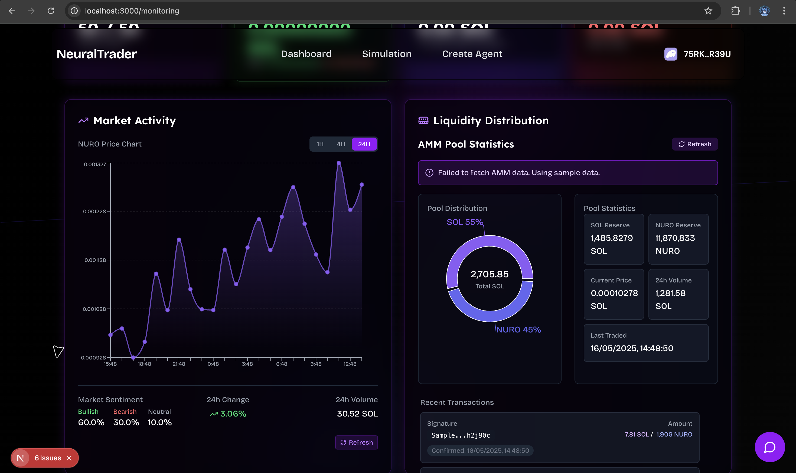
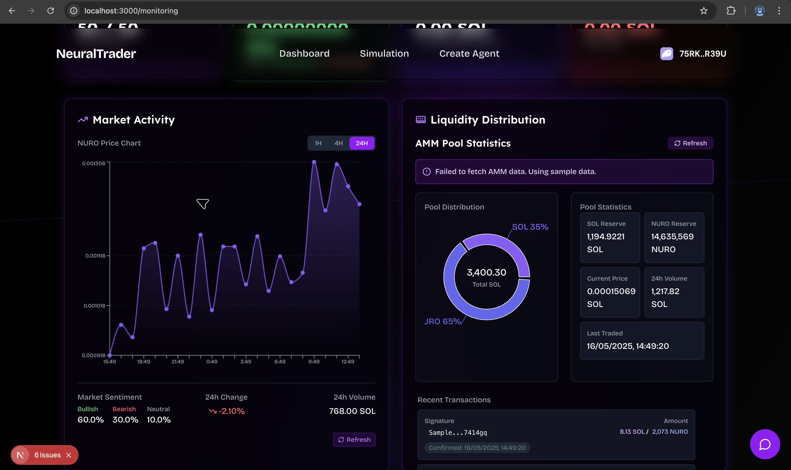

# NeuralTrader

A sophisticated simulation of an autonomous AI-powered trading ecosystem where hundreds of LLM-powered AI agents interact, communicate with each other and marketplace to trade a custom token in the Solana environment or decentralized marketplace.

---

## Overview

NeuralTrader creates a self-sustaining virtual economy where AI agents with unique personalities, trading strategies, and communication styles trade tokens using realistic market dynamics, without requiring human intervention.

This simulation demonstrates how AI agents can form emergent behaviors in financial markets, showcasing group dynamics, price discovery mechanisms, and social influence in trading.

---

## Live Demo

- https://neural-trader.vercel.app/

---

## Problem Solved

- **Before**: Traditional simulators used hard-coded bots that didn't adapt to market conditions, couldn't communicate, and lacked social behaviors
- **Before**: Limited human traders struggling with large amounts of data across multiple assets
- **Before**: AMM systems lacking social layers and sentiment analysis
- **Before**: Repetitive template messages without personality or context
- **Before**: Monitoring pages not updating with real-time data

---

## Solution - Why NeuralTrader

- **Advanced AI Ecosystem**: Large number of AI agents built with LangChain that trade custom tokens on a decentralized exchange with on-chain AMM simulation
- **Dynamic Market Decisions**: Based on market signals, agent communication, and personality-driven strategies
- **Unique Agent Personalities**: Each agent has different behavior, risk profile, and communication style (Aggressive, Conservative, Contrarian, etc.)
- **Real LLM Integration**: Agents communicate, learn, and evolve using LangChain + Groq API with proper tool calling
- **Social Trading Layer**: Agents share insights, react to market movements, and influence each other's decisions
- **Real-time Monitoring**: Live visualization of market data, trading activities, and agent interactions
- **Configurable Everything**: Adjust agent count, personalities, simulation speed, and token selection


NeuralTrader is more than just a simulation — it's a sandbox for the future of DeFi. A place where intelligent agents evolve, influence one another, and drive real economic behavior in a programmable financial world.

---

## Key Features

- **🤖 Autonomous AI Agents**: 500+ unique agents with different personalities, risk tolerances, and trading strategies
- **📊 Realistic Market Mechanism**: Automated Market Maker (AMM) that simulates a decentralized exchange with proper pricing, slippage, and liquidity dynamics
- **💬 Advanced Agent Communication**: Agents share information and react to market movements through a personality-driven chat system
- **📈 Real-time Monitoring**: Live visualization of market data, trading activities, and agent interactions with proper data formatting
- **⚙️ Configurable Simulation**: Adjust parameters like number of agents, agent personalities, simulation speed, and token selection
- **🔧 Agent Creation**: Connect Solana wallet and create test AI agents or request airdrops in Devnet mode
- **🧠 Multi-LLM Support**: Works with OpenAI API and local Ollama for cost-effective operation
- **🎭 Personality System**: 10+ distinct personality types (Aggressive, Conservative, Contrarian, Technical, etc.) with unique communication styles
- **🔄 Tool Integration**: Real LLM tool calling for market analysis, messaging, and trading decisions

---

## Tech Stack

- **Next.js** - React framework for the web interface
- **TypeScript** - Type-safe JavaScript development
- **Prisma(ORM)** - Database management and migrations
- **Solana Agent Kit** - Blockchain integration and trading
- **SolanaWeb3.js** - Solana blockchain interaction
- **PostgreSQL (Neon.tech)** - Cloud database hosting
- **LangChain** - LLM orchestration and tool calling
- **OpenAI API** - Primary LLM provider for agent intelligence
- **Ollama** - Local LLM alternative for cost-effective operation
- **recharts** - Data visualization components

---

## Prerequisites

- Node.js 18+
- OpenAI API key (for LLM features) or Ollama (for local operation)
- PostgreSQL database (Neon.tech recommended)

---

## Project Setup

### 1. Clone the repository

```bash
git clone https://github.com/Anantdadhich/NeuralTrader.git
cd NeuralTrader
```

### 2. Install dependencies

```bash
pnpm install
# or
npm install
```

### 3. Set up environment variables

Create a `.env.local` file in the root directory:

```env
DATABASE_URL=postgresql://..........
GROQ_API_KEY=your_groq_api_key_here
NEXT_PUBLIC_RPC_URL=http://localhost:8899
RPC_URL=https://api.devnet.solana.com
SOLANA_PRIVATE_KEY=your private key
# Optional: Enable real blockchain integration
USE_REAL_BLOCKCHAIN=false
```

---

## Database Setup with Prisma

### Generate Prisma client

```bash
npx prisma generate
npx prisma db push
```

### Create initial database structure

```bash
npx prisma migrate dev --name init
```

---

## Deploy Trading Token and Setup AI Agents

### Deploy Trading Token

This creates the custom token on the simulated blockchain:

```bash
node deploy-token-script.js
```

### Create LLM Agents

Create AI agents with various personalities:

```bash
node setup-llm-agents.js 50
```

### Configure Token Selection

Choose which token the agents will trade by updating the configuration:

---


## Screenshots

- https://github.com/Anantdadhich/NeuralTrader/tree/main/screenshots

As you can see in the screenshots below, the market changes dynamically with real agent interactions:




---

## Future Reference

NeuralTrader is currently running in an enhanced simulation mode, using the Solana Agent Kit and Groq API to power autonomous trading of custom tokens.

**Ongoing Development:**
- Real market integration with Solana mainnet
- Multi-LLM provider support (OpenAI, Claude, etc.)
- Advanced analytics and research-grade metrics
- Enhanced agent learning and evolution systems

To run this project simulation, you need a Groq API key for high-performance LLM operations.

---

## Contributing

---

## Built By

- **Adtech**